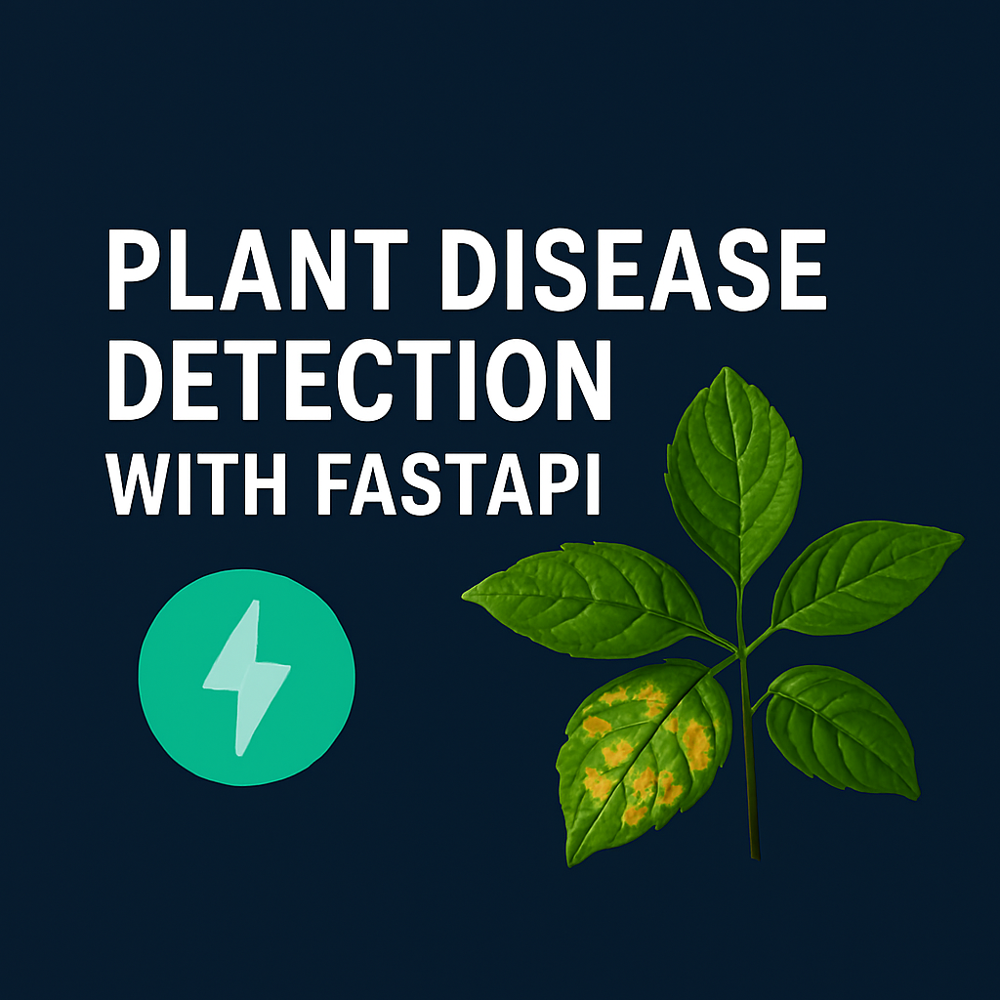

# 🌿 Plant Disease Detection with FastAPI  



This project is a **FastAPI-based web service** for detecting plant diseases from leaf images using a trained deep learning model.  
The model was trained on the **[New Plant Diseases Dataset](https://www.kaggle.com/datasets/vipoooool/new-plant-diseases-dataset)**, which contains **87,000+ RGB images** of healthy and diseased crop leaves categorized into **38 different classes**.  

Users can upload an image of a plant leaf, and the API predicts whether the leaf is **healthy** or affected by a particular disease.  

---

## 📊 Dataset  
- **Source:** [New Plant Diseases Dataset](https://www.kaggle.com/datasets/vipoooool/new-plant-diseases-dataset)  
- **Size:** ~87K images  
- **Classes:** 38 categories (healthy + diseased leaves)  
- **Split:** 80% training, 20% validation, plus 33 test images  

---

## 📓 Training Notebook  
The deep learning model (CNN) was trained using this Kaggle notebook:  
👉 [Plant Disease Detection - CNN](https://www.kaggle.com/code/virajinduruwa/plant-disease-detection-cnn)  

---

## 🚀 Features  
- ⚡ High-performance inference with **FastAPI**  
- 🤖 CNN model trained on **38 plant disease classes**  
- 📤 Upload leaf images for **real-time predictions**  
- 🧾 Returns predicted disease class + confidence score  
- 🌍 Ready for **deployment** (Docker, AWS, GCP, Azure, Render, Railway, etc.)  

---

## 🗂️ Project Structure  

├── main.py # FastAPI app
├── plant_disease_model.keras # Trained deep learning model
├── requirements.txt # Python dependencies
├── image.png # Demo image (preview)
├── .gitignore
└── README.md

---

## 📦 Installation & Setup  

1. **Clone the repository:** 
   ```bash
   git clone https://github.com/<your-username>/plant-disease-detection-fastapi.git
   cd plant-disease-detection-fastapi
   
2. **Create and activate a virtual environment:**
   python -m venv .venv
   source .venv/bin/activate   # Linux/Mac
   .venv\Scripts\activate      # Windows                                                                                

3. **Install dependencies:**
   pip install -r requirements.txt

4. **Run the FastAPI server:**
   uvicorn main:app --reload

5. **Open the app in your browser:**
   http://127.0.0.1:8000/docs                                                                                                    

---

## 🔮 Future Improvements  

- Add support for **more plant species & disease categories**  
- Deploy as a **public API with authentication**  
- Build a **mobile app frontend** (React Native / Flutter)  
- Integrate with **IoT devices** for real-time farm monitoring  

---

## 👨‍💻 Author  

**Viraj Induruwa**  
📌 *AI-Powered Plant Disease Detection System*  

---
